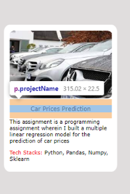

# PORTFOLIO


## Use of this Project

*__To visually showcase examples of work, while a resume only provides bullet points. This portfolio is made up for professional recommendations that will help confirm that the achievements and contributions listed on my resume are accurate.__*

---

## How to view the Portfolio

Please click on link to see the ``Portfolio``. [Shiva Chandra Portfolio</u>](https://github.com/shivachandrakante/Portfolio)

--- 
## Technologies Used
### HTML
 - Div Tag
 - Sections
 - Unorder Lists
 - Anchor Tags
 - Image Tags
### CSS
 - Flex
 - Grid
 - Selectors

 --- 

## How is Built? 
>The Portfolio page is organized into six sections.
 - Header
 - About
 - Projects
 - Skills
 - Contact
 - Footer

### Header
>The header is fixed in position throughout the portfolio.<br> I have used the Flex properties to seprate the logo name and the Navigation keys.</br> The Keywords Home, About, Projects, Skills, Contact are the navigation key. They will automatically take you to the respective section on clicking.</br>


--- 

### About
>The About section is all about me and my interests and experience. This section also has two parts: one is about me and the other is my work experience.


--- 

### Projects
>The Project section has differnt projects in the different cards. I have used grid functionality for that. Each card has four parts. 
> 1. Project image
> 2. Project name.
> 3. Project details.
> 4. Tech Stacks used in the project. 




---

### Skills
>The Skills section has skills i know in different cards. I have used grid functionality for that. Each card has four parts. 


```CSS
.container .sections .skills .skillsInformation{
    width: inherit;
    height: 400px;
    display: grid;
    grid-template-columns: repeat(4,150px);
    row-gap: 5%;
    grid-template-rows: auto;
    background-color: rgb(255, 255, 255);
    font-size: 16px;
    font-weight: lighter;
    color: black;
    text-align: center;
    /* box-sizing: border-box; */
    justify-content: space-between;
    align-content: center;
    align-items: center;
    padding: 0% 15%;
}
```

---

### Contact
>The Skills section has skills i know in different cards. I have used grid functionality for that. Each card has four parts. 
> contact has two sub-parts 
>   1. Contact heading
>   2. Contact Content
>       - Image
>       - content Information
>           - Logo Anchor Keys
>               - Linkedln
>               - Gmail
>               - GitHub
>           - Contact Form 


---

### Footer
>At bottom of the webpage we have the Footer Section.


---
## License
> This Package is licensed under the MIT license. See License for details.